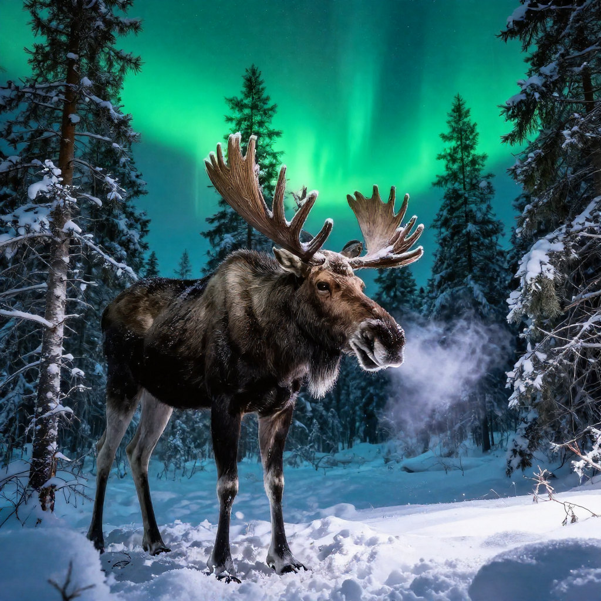
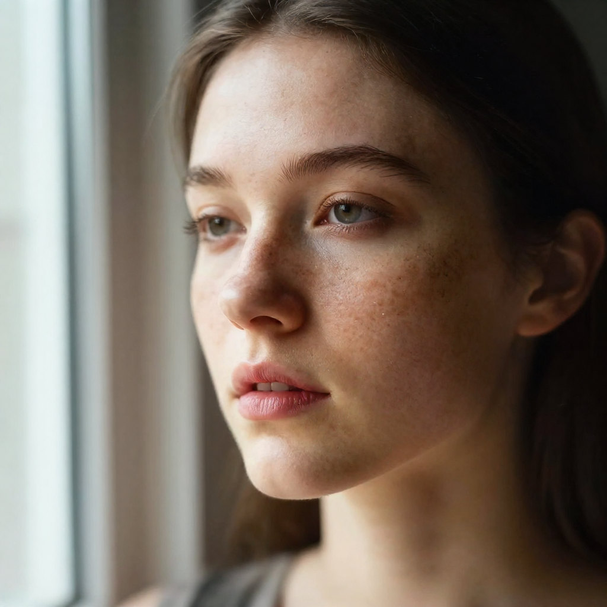
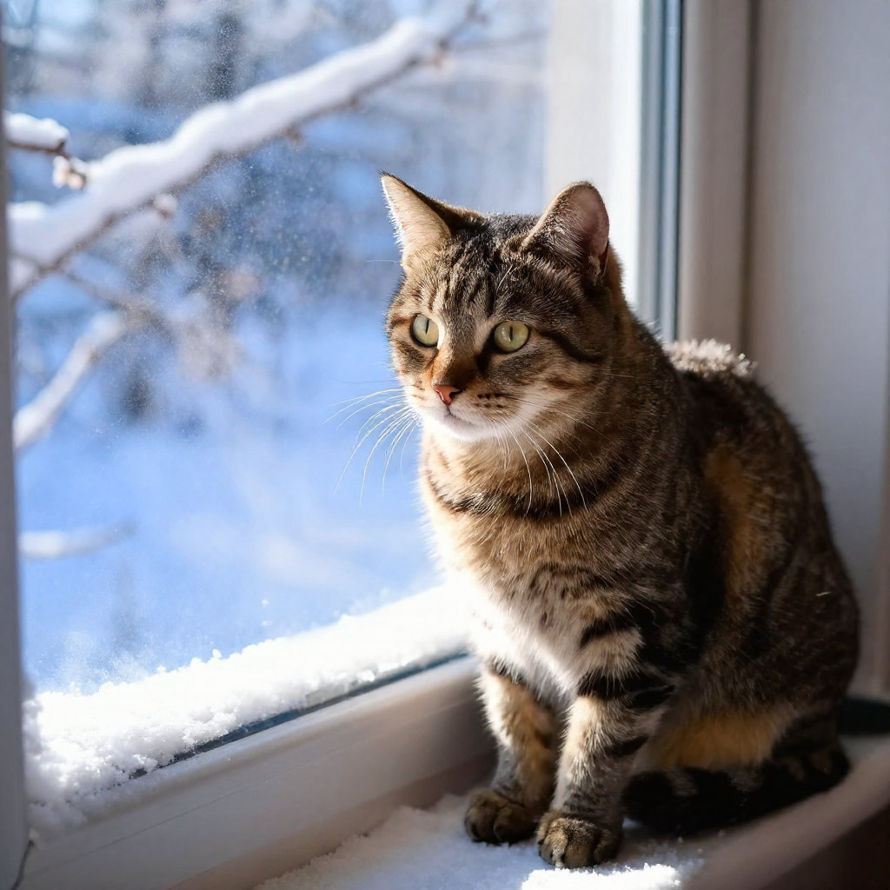
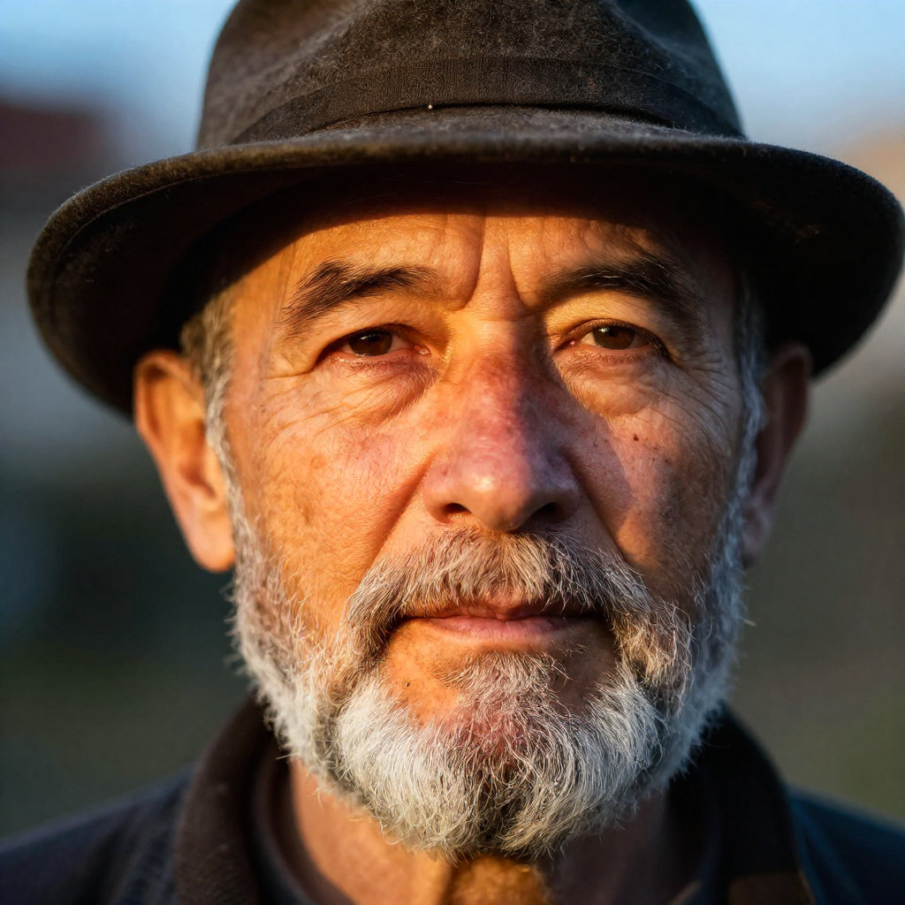
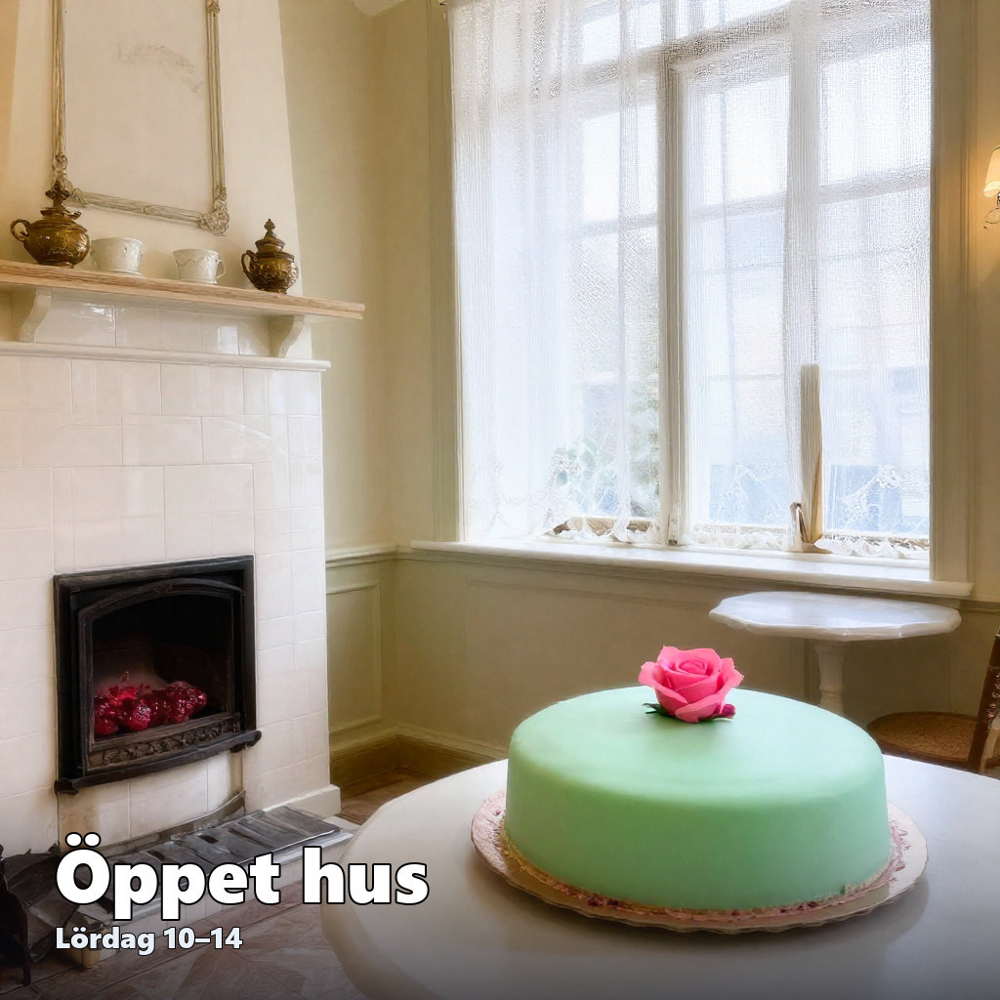
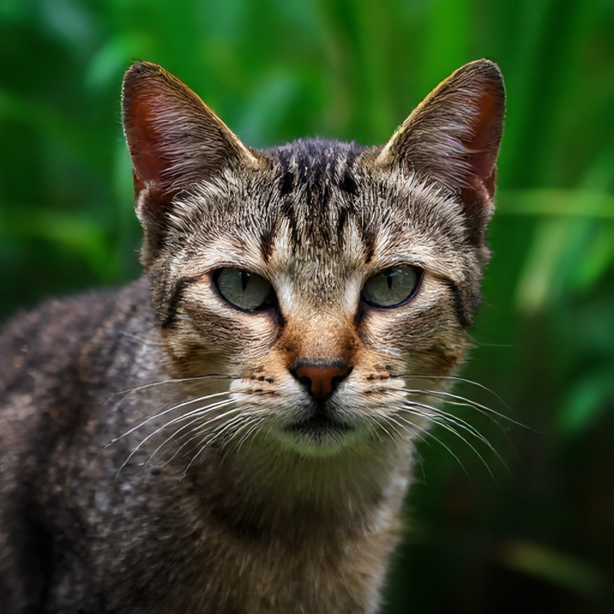
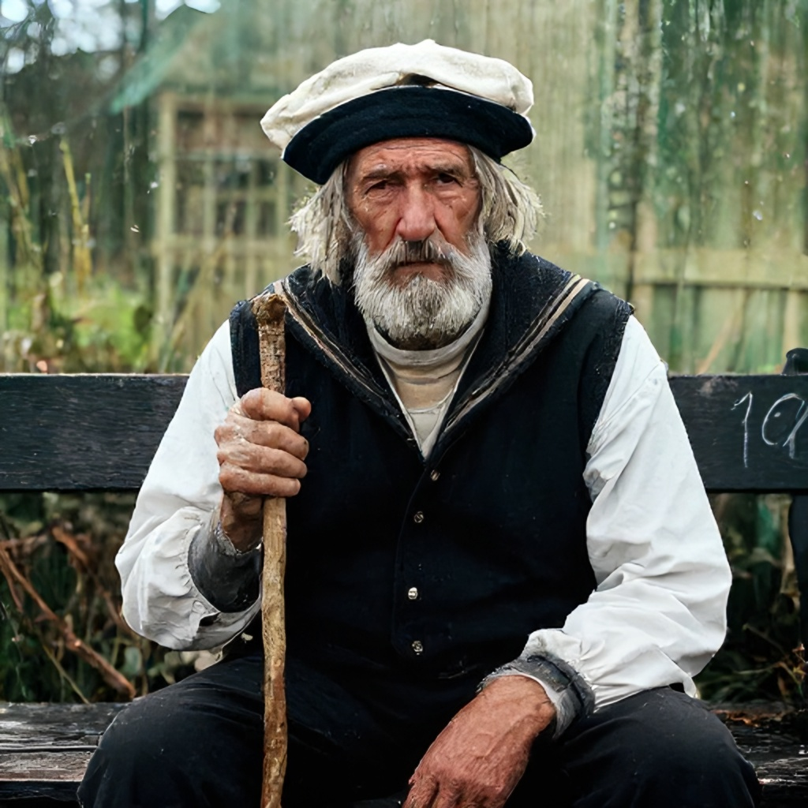
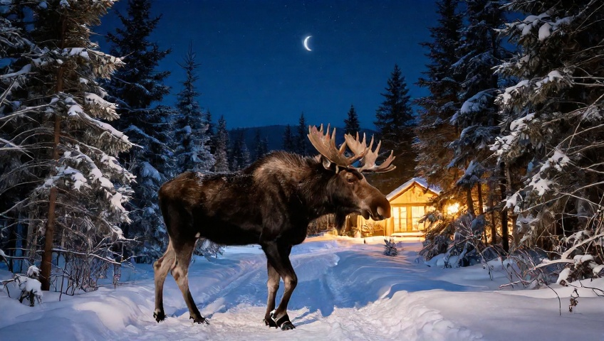
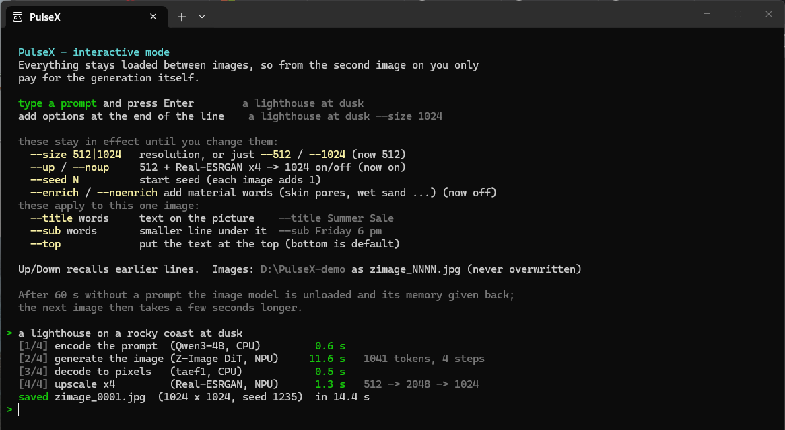

# PulseX — text to image on the Snapdragon NPU

[](https://github.com/Erik-matrix/pulsex-zimage/releases/latest)
[](LICENSE)

PulseX turns a sentence into a picture with **Z-Image-Turbo**, running the diffusion
transformer on the Hexagon NPU of a Snapdragon X Plus laptop (Windows on ARM) through the PulseX
fork of ggml-hexagon. The command is `zimage`; the window and the UI say PulseX.

| Stage | Model | Runs on |
|---|---|---|
| Text encoder | Qwen3-4B, GGUF Q4_0 (`hidden_states[-2]`) | NPU, loaded for each prompt (default), or CPU |
| Diffusion transformer | Z-Image-Turbo, GGUF Q4_0, 4 steps | NPU (HTP0) |
| Decoder | taef1 (C++/NEON) or the full Flux VAE | CPU |
| Upscaler (512 → 1024) | QuickSRNet-Large x4 w8a8 (default) or Real-ESRGAN x4, via ONNX Runtime's QNN EP | NPU |

Typical times on an X Plus: 512 + upscale ~11.5 s (`zimage make`, everything cold; a plain 512 ~11 s); wide 480p
(848 × 480) ~17 s cold and ~16 s in the REPL; native 1024 ~40 s.

## Examples

All six made on the NPU at native 1024 × 1024 — the prompt is exactly what was typed. Three of
them are in Swedish; `-Enrich` adds the English words the model needs (see *Making images*). The
text on the café is drawn afterwards, correctly spelled (see *Text on the picture*).

| | |
|---|---|
|  |  |
| `zimage make "forsarna i kalixälven under midnattssolen" -Size 1024 -Enrich -Seed 11` | `zimage make "en älg i en snöig granskog under norrskenet" -Size 1024 -Enrich -Seed 11` |
|  |  |
| `zimage make "portrait of a young woman with freckles by a window, soft window light" -Size 1024 -Enrich -Seed 4242` | `zimage make "a tabby cat on a windowsill, winter light, snow outside" -Size 1024 -Enrich -Seed 4242` |
|  |  |
| `zimage make "portrait of an old man with a felt hat and a grey beard, warm evening light" -Size 1024 -Enrich -Seed 11` | `zimage make "interiörbild av ett gammalt konditori med kakelugn, spetsgardiner och prinsesstårta på porslin" -Size 1024 -Enrich -Seed 11 -Title "Öppet hus" -Subtitle "Lördag 10–14"` |

**With the UltraReal LoRA** (see *A LoRA*) — the default size, 512 + upscale, about 14 s each. Typed as is;
the LoRA's trigger word is added by itself:

| | |
|---|---|
|  |  |
| `zimage make "a close up picture of a cat in jungle"` | `zimage make "a old sailor man sitting on a bench with his stick looking into camera with sad eyes"` |

**Wide 480p** — 848 × 480, the frame size many of the newer video models work in:



`zimage make "a large bull moose walking on a snowy forest path at night, snow-covered spruce trees, crescent moon in a starry sky, warm light from a cabin far behind the trees, cinematic" -Size 480p -Seed 7`

The NPU is not bit-deterministic, so the same command gives a nearly — not exactly — identical
image.

## Setup

**Hardware.** Tested on Snapdragon X Plus (X1P42100, Hexagon NPU v73). Snapdragon X Elite and
the other X1 chips have the same NPU and should work. Snapdragon X2 is untested: its NPU skel
(`libggml-htp-v81.so`) is built and picked automatically, but the kernels were tuned on v73 and
the optional Real-ESRGAN QNN context is compiled for X1 and has to be recompiled for X2 (QuickSRNet, the default
upscaler, is compiled on your machine the first time it runs).

**Requirements:** a Snapdragon X Plus laptop (Hexagon NPU v73; see Hardware) on Windows 11 ARM64, the
[Microsoft Visual C++ Redistributable for ARM64](https://aka.ms/vs/17/release/vc_redist.arm64.exe)
and Python 3.12 for ARM64 with `pip install -r requirements.txt`.

**Download.** Clone the repository, or take the zip from the [latest release](https://github.com/Erik-matrix/pulsex-zimage/releases/latest) — both contain everything in this folder, binaries included.

**Prebuilt binaries.** The release repository ships them in `bin/` (llama-server,
zimage-dit-stream, zimage-encode, ggml, taef1_decode and the DSP skel `libggml-htp-v7x.so` + catalog), plus
`zimage.exe` next to the scripts. To build them yourself: the PulseX fork of ggml-hexagon
(`bld_wos.bat`; `zimage_stream.cpp` builds there as `examples/zimage_dit`), `bld_cli.bat` for
`zimage.exe`, and `taef1_decode.cpp` from the PulseX tree.

> **The DSP skel is self-signed.** Windows only loads it on a machine set up to accept
> self-signed NPU modules (a developer setup). On a stock machine the NPU part is refused; that
> needs a Microsoft-attestation-signed skel, which this project does not have yet.

**Models** (not included — see License). Put them on a fast SSD (an SD card made weight loading
23× slower) in one folder:

| File | What / where from |
|---|---|
| `z-image-turbo-q4_0.gguf` | Tongyi-MAI/Z-Image-Turbo, converted with `tools/convert_zimage_to_gguf_q4.py` in the ggml-hexagon fork |
| `qwen3-4b-zimage-q4_0.gguf` | the Qwen3-4B text encoder of Z-Image-Turbo, converted and quantized to Q4_0 with llama.cpp |
| `taef1/diffusion_pytorch_model.safetensors` | madebyollin/taef1 |
| `vae/ae.safetensors` | optional, the full Flux VAE (only for `-Vae full`) |
| `quicksrnetlarge.onnx` + `quicksrnetlarge.data` | Qualcomm AI Hub, QuickSRNetLarge, w8a8, ONNX — the default upscaler. The first image makes a 512 × 512 copy next to it (needs `pip install onnx`) and saves the compiled NPU graph (`_ctx.onnx`); after that it loads in a moment |
| Real-ESRGAN x4 QNN context (`esrgan_x4.bin` + `.wrap.onnx`) | optional (`-Upscaler esrgan`): Qualcomm AI Hub, Real-ESRGAN-x4plus, compiled for the device |

**Configure.** Copy `zimage.example.json` to `zimage.json` and set the paths (`zimage.json` is
local and not checked in). `zimage config` lists every path with `[ok]` or `[MISSING]`.

**Folder names.** Paths may contain any letters (å, ä, ö, Ł …): the models, the work files and your user name.
One exception comes from the NPU driver: it only loads its runtime from a folder whose path is plain A–Z. When
`bin/` or the QNN runtime sits in such a folder (for example under `C:\Users\<a name with å/ä/ö>\Downloads`), PulseX
copies it once to `C:\ProgramData\PulseX\npu\` and runs it from there, and says so in one line. To avoid the copy,
keep PulseX in a folder such as `C:\PulseX`.

## Making images

```
zimage make "a lighthouse at dusk"
```
512 × 512, upscaled to 1024 × 1024. Saved as `zimage_0001.jpg`, then `_0002` … in the current
folder — an earlier image is never overwritten.

| What | Example |
|---|---|
| plain 512, fastest — for trying prompts | `zimage make "a lighthouse at dusk" -NoUp` |
| force the upscaler on (if the config has it off) | `zimage make "a lighthouse at dusk" -Up` |
| native 1024 — most detail, for keepers | `zimage make "a lighthouse at dusk" -Size 1024` |
| wide 480p (848 × 480), no upscaler | `zimage make "a lighthouse at dusk" -Size 480p` |
| any width × height | `zimage make "a lighthouse at dusk" -Size 1280x720` |
| another image for the same text | `zimage make "a lighthouse at dusk" -Seed 7` |
| exact file name (.jpg or .png) | `zimage make "a lighthouse at dusk" -Out lighthouse.png` |
| JPEG quality | `zimage make "a lighthouse at dusk" -Quality 90` |
| add material words to the prompt | `zimage make "portrait of an old fisherman" -Enrich` |
| see where the time goes | `zimage make "a lighthouse at dusk" -Timings` |

**Sizes.** `512` and `1024` are square; `480p` is 848 × 480 and `720p` is 1280 × 720; any
`WxH` works when both sides are divisible by 16 (the decoder works in 8 × 8 pixel blocks and the
transformer in 2 × 2 of those), from 256 to 2048. That is why the 854 × 480 of video is 848 × 480
here. Only 512 goes through the x4 upscaler, which is compiled for exactly 512 × 512. Cost follows
the pixel count: 848 × 480 is 1.6× the pixels of 512 × 512 and 40 % of 1024 × 1024.

`-Enrich` appends words the model responds to (from `cues.json`), for example
`portrait` → "skin pores, natural skin texture". The prompt that is actually sent is printed.
It adds detail but can change the composition.

**Swedish prompts.** The model gets the scene and mood from Swedish but drops specific nouns:
"en älg i en snöig granskog under norrskenet" gave a snowy forest without the moose or the
aurora. With `-Enrich` / `--enrich`, known Swedish words also add the English noun, first, before the
material words — then the moose and the aurora appear. The table covers the north (`älg`,
`norrsken`, `granskog`, `snöig`, `stuga`, `fors`/`forsarna`, `midnattssol`, `Kalixälven` …),
cafés (`kafé`, `fika`, `ljusslinga`, `pappersstjärna` …), people, sea and town, with common
inflections. English prompts remain the most reliable.

The café words cover all three kinds of café: the old timber house (`kakelugn`, `förstukvist`,
`spetsgardin`, `emaljskylt`, `julstjärna`, `thonetstol`, `blommig tapet`, `vaxduk` …), the
small-town café (`konditori`, `prinsesstårta`, `semla`, `kardemummabulle`, `porslin` …) and the
rock'n'roll diner (`hamburgerbar`, `jukebox`, `neonskylt`, `LP-skivor`, `jänkare` …).

A prompt that only lists things tends to become a close-up still life. Say the view first:
`interiörbild av …` (wide interior shot), `vidvinkel` / `helbild` (wide-angle) or `närbild`
(close-up).

```
zimage make "interiörbild av ett gammalt konditori med kakelugn, spetsgardiner och prinsesstårta på porslin" -Enrich
```

```
zimage make "ett gammalt kafé med ljusslingor och en pappersstjärna i fönstret" -Enrich
```

## Text on the picture

The model cannot spell reliably, so text is drawn afterwards, correctly spelled (å, ä, ö work).

| What | Example |
|---|---|
| a title | `zimage make "a cozy café interior" -Title "Open House"` |
| title and a smaller line under it | `zimage make "a cozy café interior" -Title "Open House" -Subtitle "Saturday 10-14"` |
| at the top instead of the bottom | `zimage make "a cozy café interior" -Title "Open House" -TextPos top` |
| on an existing photo (no new image) | `zimage text photo.jpg -Title "Open House" -Subtitle "Saturday 10-14"` |

`zimage text` writes `photo_text.jpg` next to the original unless `-Out` is given.

Everything combines — native 1024, material words and text in one go:

```
zimage make "a cozy café interior" -Size 1024 -Enrich -Title "Open House" -Subtitle "Saturday 10-14"
```

The same in the REPL (the order of the options does not matter; the text ends at the next `--`):

```
a cozy café interior --1024 --enrich --title Open House --sub Saturday 10-14
```

`--1024` and `--enrich` stay in effect for the following images; the text is for this image only.

## Interactive mode (REPL)

```
zimage repl
```
The models stay loaded, so from the second image on you only pay for the generation.



Type a prompt and press Enter. Options go at the end of the line:

| Line | What it does |
|---|---|
| `a red fox in the snow` | an image with the current settings |
| `a red fox in the snow --1024` | native 1024 from now on (`--512` goes back) |
| `a red fox in the snow --size 1024` | the same, long form |
| `a red fox in the snow --480p` | wide 848 × 480 from now on (`--size 1280x720` for any W×H divisible by 16) |
| `a red fox in the snow --noup` | plain 512 from now on (`--up` turns the upscaler back on) |
| `a red fox in the snow --seed 42` | restart the seed sequence at 42 (each image adds 1) |
| `a red fox in the snow --enrich` | material words on from now on (`--noenrich` turns them off) |
| `a red fox in the snow --title Winter Sale --sub Friday 6 pm` | text on this image only |
| `a red fox in the snow --title Winter Sale --top` | text at the top, this image only |
| `--1024` | change a setting without making an image |

Up/Down recalls earlier lines. `Ctrl+D`, `quit` or closing the window ends the session and frees
the NPU memory. After 60 idle seconds the image model is unloaded on its own (see Memory).

## Other commands

| Command | What it does |
|---|---|
| `zimage serve` | start the text encoder and leave it running (`make` then skips the start-up) |
| `zimage make "..." -Keep` | leave the encoder running after this image |
| `zimage stop` | stop everything, free NPU memory, drop the model files from the cache |
| `zimage status` | what is running, and how much memory is cached |
| `zimage config` | the config file, every path with `[ok]`/`[MISSING]`, the defaults |
| `zimage version` | the version |
| `zimage help` | all commands and options |

Rarely needed: `-Steps N` (the model is trained for 4), `-Vae full` (the reference decoder,
slower), `-EncoderOn cpu` (see Memory), `-NoServer` (no warm encoder, slower fallback),
`-Pause` (wait for Enter before closing — for shortcuts), `-Cascade` (1024 via a 512 pass,
experimental, with `-Tail N`).

## A LoRA: UltraReal (optional)

[Lenovo UltraReal](https://huggingface.co/Danrisi/Lenovo_UltraReal_Z_Image) (Apache-2.0) gives Z-Image-Turbo the
look of a real camera: fur, skin, hands and lens blur like a photograph instead of a smooth rendering. The NPU
engine has no LoRA at run time, so the LoRA is baked into the model once:

1. Download the original transformer of [Tongyi-MAI/Z-Image-Turbo](https://huggingface.co/Tongyi-MAI/Z-Image-Turbo)
   (the `transformer/` folder, about 24.6 GB) and the LoRA (`lenovo_z.safetensors`).
2. Build the model (needs `pip install gguf safetensors torch`; it reads one tensor at a time, so it fits in a
   normal amount of memory):

   ```
   python build_lora_from_fp32.py <transformer folder> <models>\z-image-turbo-q4_0.gguf <models>\z-image-turbo-ultrareal06-q4_0.gguf lenovo_z.safetensors 0.6
   ```

3. In `zimage.json` point `paths.dit` at the new file and set `defaults.prompt_prefix` to `"l3n0v0, "` — the
   LoRA's trigger word, which is then put in front of every prompt automatically. The first image writes a new `.hexpack`.

0.6 is the strength used for the examples; 1.0 is stronger. The LoRA is added to the **original** weights and
quantized to Q4_0 once: adding it to the Q4_0 model directly (`merge_lora_q4.py`, kept for reference) keeps only a
few percent of it, because small changes round back to the same Q4_0 value.

## Configuration (`zimage.json`)

Every key is documented in `zimage.example.json` (`_help`). Command-line options win over it.

| Key | Default | Meaning |
|---|---|---|
| `defaults.size` | `512` | `512`, `1024`, `"480p"` (848 × 480), `"720p"` or `"WxH"` with both sides divisible by 16 |
| `defaults.upscale` | `true` | 512 images go through the x4 upscaler to `upscale_to` |
| `defaults.upscale_engine` | `quicksrnet` | `quicksrnet` (0.06 s on the NPU) or `esrgan` (Real-ESRGAN, 1.1 s); `-Upscaler` / `--upscaler` for one run or, in the REPL, until changed. Without `paths.quicksrnet_x4` it is Real-ESRGAN |
| `defaults.upscale_detail_quicksrnet` | `0.6` | 0..1: share of the QuickSRNet result, the rest a plain Lanczos enlargement. 0.6 has the detail of Real-ESRGAN at 0.5 with truer colour and less painted skin; 1.0 overshoots at fine bright lines |
| `defaults.upscale_detail` | `0.5` | the same for Real-ESRGAN: 0..1 share of its result; the rest is a plain Lanczos enlargement. 1 is sharpest but can look plastic, 0 is softest. |
| `defaults.shift` | `1.0` | sigma shift; 1.0 (linear [1, .75, .5, .25]) gave more skin and fur detail than 3.0 on every test prompt |
| `defaults.encoder` | `npu` | `npu`: loaded on the NPU for each prompt and released right after; `cpu`: a warm server reading the weights from the file cache. See Memory |
| `defaults.enrich` | `false` | material words on by default |
| `defaults.unload_after_s` | `60` | REPL: unload the image model after this many idle seconds (0 = never) |
| `defaults.npu_weight_budget_mb` | `0` | NPU memory for the image model's weights: `0` streams them through two slots (~0.2 GB), `-1` keeps all 3.3 GB on the NPU. See Memory |
| `defaults.pack_cache` | `true` | store the weights once in the NPU's own tiled layout next to the model (`.hexpack`, 3.5 GB) and just copy them from then on |
| `defaults.purge_on_start` / `purge_on_exit` | `standby` | empty Windows' standby cache when the REPL starts / on stop and exit: `standby`, `full` (also trim every process's working set) or `off` |

## Memory

Everything the NPU holds is `rpcmem`, which Windows counts as **committed** memory. Measured on
an X Plus (16 GB):

| Part | Committed |
|---|---|
| Diffusion transformer weights | 0.2 GB by default (streamed, see below); 3.3 GB with `npu_weight_budget_mb: -1` |
| its graph buffers (512 / 480p / 1024) | 0.15 / 0.24 / 0.6 GB — only while an image is made; the REPL frees them between images |
| Text encoder on the NPU (default) | 0.27 GB — its layers stream through two slots; ~1 s per prompt, then it exits |
| Text encoder on the CPU (`-EncoderOn cpu`, `--no-repack`, mmap) | 0.5 GB, for the whole session |
| Upscaler session | QuickSRNet 0.1 GB (default), Real-ESRGAN 0.9 GB — released after every upscale, reopened behind the next DiT run |
| taef1 decoder at 1024 | 0.8 GB, only while decoding |

That is why nothing sits on the NPU that is not needed right now. The text encoder is a
short-lived process (`zimage-encode.exe`): in the REPL it starts loading on the first key you type
(~0.35 s), encodes when you press Enter (~0.6 s) and exits (~0.1 s). Like the image model, its
layers stream: llama.cpp only tokenizes, and the 35 layers the image model needs run one at a time
through two ~54 MB slots, copied from `qwen3-4b-zimage-q4_0.hexpack` (the layers in the NPU's
tiled layout, written next to the model the first time, 2 GB). Layer 36 and the output head are
never loaded — the image model reads the input of the last layer. The encodings match the
llama.cpp path (`ZI_ENC_STREAM=0`, the whole model on the NPU, 2.3 GB) to within the NPU's own
noise. Between images the image model keeps only its NPU session and gives back its slots and
graph buffers. The image model itself is unloaded after an idle minute (the next image then takes a few
seconds longer).

Measured in the REPL, two 848 × 480 images with a rest after each, committed memory above what
it was before PulseX started: **+0.3 GB between images, +1.0 GB at the peak**, back to zero after
quitting. (With the whole encoder on the NPU the peak was +2.6 GB, and with the image model's
weights resident as well, +6.8 GB.)

**The image model's weights stream.** The transformer has 34 blocks of ~97 MB. By default only
two block-sized slots live on the NPU; each step copies the next block's weights into the free slot
while the NPU computes on the other. The source is `z-image-turbo-q4_0.hexpack`, a copy of the
weights already in the NPU's tiled layout — written next to the model the first time (~5 s,
3.5 GB) and rebuilt by itself when the model file changes. It is read through Windows' file cache,
which shows as *Cached*, not *Committed*, and which Windows can take back at any time. Measured on
an X Plus, 4 steps, identical images:

| | all weights on the NPU | streamed (default) |
|---|---|---|
| 512 × 512 | 9.7 s, +3.75 GB committed | 8.8 s, +0.64 GB |
| 1024 × 1024 | 36.4 s, +4.6 GB | 35.6 s, +1.9 GB |

`npu_weight_budget_mb` sits anywhere between: blocks stay on the NPU, in the order they run, while
they fit under the budget, and the rest stream.

To give PulseX room, the REPL can empty Windows' whole standby cache ("Cached" in Task Manager)
when it starts and when it closes. That call needs administrator rights, so it only happens when
PulseX runs as administrator — set the shortcut to *Properties > Shortcut > Advanced > Run as
administrator*. Otherwise PulseX drops only its own model files from the cache.

Mapping the weights from the file does not help: the Windows FastRPC driver can import a
read-only file view into the DSP (`remote_register_buf_attr2` with
`FASTRPC_ATTR_IMPORT_BUFFER | FASTRPC_ATTR_READ_ONLY`, then `rpcmem_to_fd` and `fastrpc_mmap` —
the path QNN uses), and the DSP reads it correctly, but the driver charges the full size to
committed memory while it is mapped (measured +254–258 MB for a 256 MB view). Anything the NPU can
see costs committed memory; only a model that stays on the CPU side can live purely in the file
cache.

## Files

| File | Role |
|---|---|
| `zimage.ps1` | the CLI: commands, help, encoder-server lifecycle, cache cleanup |
| `zimage.py` | the engine driver: encoder → DiT → decoder → upscaler, REPL, text overlay |
| `zimage_stream.cpp` | `zimage-dit-stream.exe`, the DiT on ggml-hexagon (built by the ggml-hexagon tree): weight budget, streaming slots, `.hexpack` cache |
| `zimage_encode.cpp`, `zimage_encode_stream.h` | `zimage-encode.exe`, the text encoder as a short-lived NPU process (same build); the header streams its layers through two slots |
| `zimage_launch.c`, `zimage.rc`, `zimage.ico`, `bld_cli.bat` | the `zimage.exe` launcher (also `--drop-cache` and `--purge`) |
| `enrich.py`, `cues.json` | prompt enrichment |
| `build_lora_from_fp32.py` | bakes a LoRA into the Q4_0 model from the original weights (see *A LoRA*); `merge_lora_q4.py` = the route that does not work, kept for reference |
| `zimage.example.json` | configuration template |
| `tools/` | measurement and diagnostic scripts (memory sampler, profilers, probes) |
| other `*.py` / `*.cpp` | development references and golden-data checks from the port |

## License

The PulseX code in this repository is released under the [MIT License](LICENSE).

The models are **not** included and keep their own licenses — check them before you use or
share images commercially: Z-Image-Turbo (Tongyi-MAI), Qwen3-4B (Qwen), taef1 (madebyollin),
the Flux VAE (Black Forest Labs), QuickSRNet (Qualcomm, BSD-3-Clause, AIMET model zoo) and Real-ESRGAN
(Xintao Wang et al.). ggml-hexagon and
llama.cpp are MIT-licensed; ONNX Runtime is MIT-licensed; the Qualcomm QNN/QAIRT runtime is
under Qualcomm's own license.
